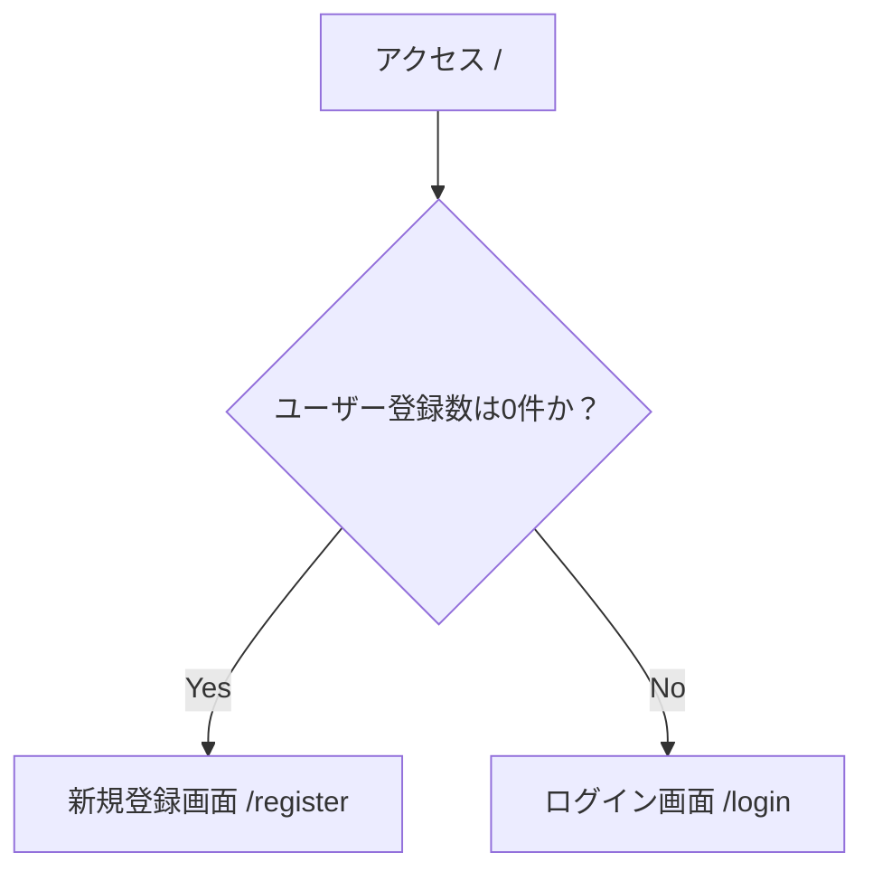
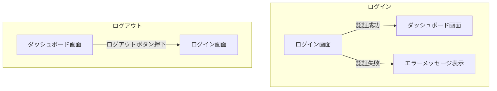

# 画面設計書

## 1. 概要

本ドキュメントは、アプリケーションの画面構成と画面フローを定義する。
主なフローは「初回ユーザー登録」「ログイン・ログアウト」「ログイン後のダッシュボード表示」である。

## 2. 画面フロー

### 2.1. 初期アクセス時のフロー

ユーザーがアプリケーションに初めてアクセスした際の画面フローを定義する。
システムのユーザー登録数に応じて、表示する画面を切り替える。



- **条件分岐:**
    - 登録ユーザー数が0件の場合、アプリケーションの初回利用とみなし、管理者となる最初のユーザーを登録させるため「新規登録画面」へリダイレクトする。
    - 登録ユーザーが1件以上存在する場合、通常の「ログイン画面」を表示する。
- **技術的要件:**
    - フロントエンドは、アプリケーションのロード時にバックエンドのAPIを呼び出し、現在のユーザー登録数を確認する必要がある。

### 2.2. ログイン・ログアウトフロー



- **ログイン:**
    - ユーザーがログイン画面で正しい認証情報を入力し、認証が成功すると「ダッシュボード画面」に遷移する。
    - 認証に失敗した場合は、ログイン画面に留まり、エラーメッセージを表示する。
- **ログアウト:**
    - ユーザーがダッシュボード画面のログアウトボタンを押下すると、セッションを破棄し、「ログイン画面」に遷移する。

## 3. 各画面の定義

### 3.1. 新規登録画面 (`/register`)

- **目的:** システムに最初のユーザーを登録する。
- **表示条件:** 登録ユーザー数が0件の時に、ルートパス(`/`)アクセスで自動的に表示される。
- **画面要素:**
    - ユーザー名入力フィールド
    - パスワード入力フィールド
    - パスワード確認用フィールド
    - 登録ボタン
- **機能:**
    - 登録ボタンを押下すると、入力された情報でユーザーを作成する。
    - 登録完了後は、自動的にログイン状態となり「ダッシュボード画面」へ遷移する。

### 3.2. ログイン画面 (`/login`)

- **目的:** 登録済みユーザーがシステムにログインする。
- **表示条件:**
    - 登録ユーザーが1件以上いる場合のルートパス(`/`)アクセス時。
    - ログアウト時。
    - 未ログイン状態で認証が必要なページへアクセスしようとした時。
- **画面要素:**
    - ユーザー名入力フィールド
    - パスワード入力フィールド
    - ログインボタン
- **機能:**
    - ログインボタンを押下すると、入力された情報でユーザー認証を行う。
    - 認証成功後、「ダッシュボード画面」へ遷移する。

### 3.3. ダッシュボード画面 (`/dashboard`)

- **目的:** ログイン後のユーザーにアプリケーションのメイン機能へのアクセスを提供する。
- **表示条件:** ログイン認証が成功した後に表示される。
- **画面要素:**
    - ヘッダー
        - アプリケーションロゴ/タイトル
        - ログアウトボタン
    - サイドナビゲーション（将来的な機能拡張用）
        - ダッシュボードメニュー
        - ユーザー管理メニュー
    - メインコンテンツエリア
        - 「ようこそ、{ユーザー名}さん」のようなウェルカムメッセージ
        - 主要な情報や機能へのショートカット（例: お知らせ、統計情報など）
- **機能:**
    - 各メニュー項目をクリックすると、対応する機能ページへ遷移する。
    - ログアウトボタンでログイン画面に戻る。

## 4. 必要なAPI

本画面設計を実現するために、バックエンドで以下のAPIエンドポイントが必要となる。

### 4.1. `GET /api/users/count`

- **目的:** 現在の登録ユーザー数を取得する。
- **レスポンス:**
  ```json
  {
    "count": 0
  }
  ```

### 4.2. `POST /api/register/initial`

- **目的:** 初回ユーザーを登録する。
- **リクエストボディ:**
  ```json
  {
    "username": "admin",
    "password": "password123"
  }
  ```
- **補足:** このAPIは、登録ユーザー数が0件の場合のみ成功する。

### 4.3. `POST /api/login`

- **目的:** ユーザー認証を行う。
- **リクエストボディ:**
  ```json
  {
    "username": "admin",
    "password": "password123"
  }
  ```
- **レスポンス (成功時):**
  ```json
  {
    "token": "xxxxxxxxxxxxx"
  }
  ```

### 4.4. `POST /api/logout`

- **目的:** ユーザーセッションを破棄する。
