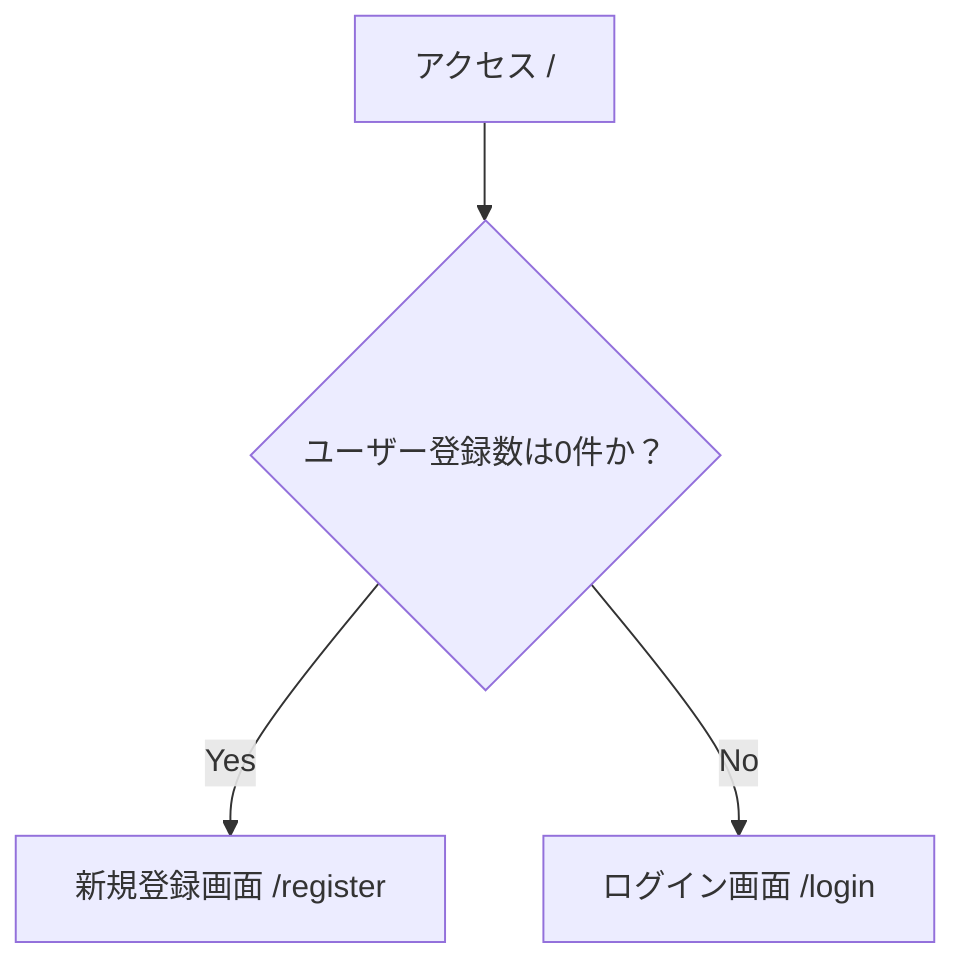
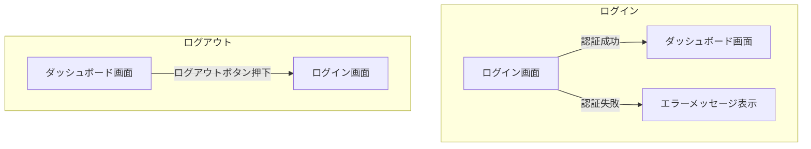
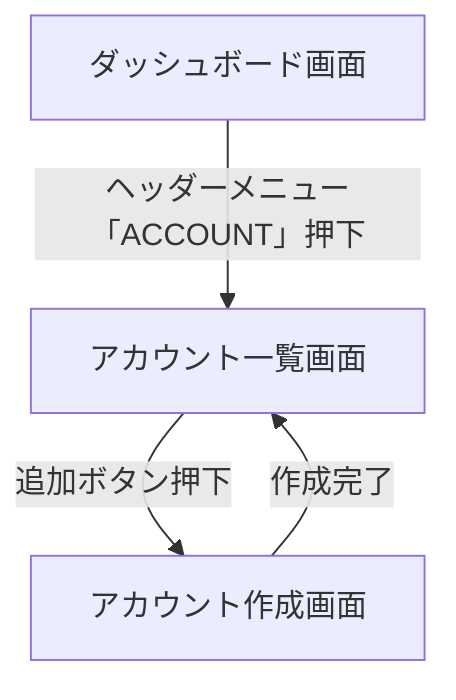

# 画面設計書

## 1. 概要

本ドキュメントは、アプリケーションの画面構成と画面フローを定義する。
主なフローは「初回ユーザー登録」「ログイン・ログアウト」「ログイン後のダッシュボード表示」「アカウント管理」である。

## 2. 画面フロー

### 2.1. 初期アクセス時のフロー

ユーザーがアプリケーションに初めてアクセスした際の画面フローを定義する。
システムのユーザー登録数に応じて、表示する画面を切り替える。



- **条件分岐:**
    - 登録ユーザー数が0件の場合、アプリケーションの初回利用とみなし、管理者となる最初のユーザーを登録させるため「新規登録画面」へリダイレクトする。
    - 登録ユーザーが1件以上存在する場合、通常の「ログイン画面」を表示する。
- **技術的要件:**
    - フロントエンドは、アプリケーションのロード時にバックエンドのAPI(`GET /api/initial-route`)を呼び出し、レスポンスで指定されたパスへリダイレクトする。

### 2.2. ログイン・ログアウトフロー



- **ログイン:**
    - ユーザーがログイン画面で正しい認証情報を入力し、認証が成功すると「ダッシュボード画面」に遷移する。
    - 認証に失敗した場合は、ログイン画面に留まり、エラーメッセージを表示する。
- **ログアウト:**
    - ユーザーがダッシュボード画面のログアウトボタンを押下すると、セッションを破棄し、「ログイン画面」に遷移する。

### 2.3. アカウント管理フロー



- **一覧表示:**
    - ダッシュボードのヘッダーにある「ACCOUNT」リンクからアカウント一覧画面へ遷移する。
- **新規追加:**
    - アカウント一覧画面の「追加」ボタンからアカウント作成画面へ遷移し、新しいユーザーを作成する。

## 3. 各画面の定義

### 3.1. 新規登録画面 (`/register`)

- **目的:** システムに最初のユーザーを登録する。
- **表示条件:** 登録ユーザー数が0件の時に、ルートパス(`/`)アクセスで自動的に表示される。既存ユーザーが存在する場合は表示できない（API側でエラーとする）。
- **画面要素:**
    - ユーザー名入力フィールド
    - パスワード入力フィールド
    - パスワード確認用フィールド
    - 登録ボタン
- **機能:**
    - 登録ボタンを押下すると、入力された情報でユーザーを作成する。
    - 登録完了後は、自動的にログイン状態となり「ダッシュボード画面」へ遷移する。

### 3.2. ログイン画面 (`/login`)

- **目的:** 登録済みユーザーがシステムにログインする。
- **表示条件:**
    - 登録ユーザーが1件以上いる場合のルートパス(`/`)アクセス時。
    - ログアウト時。
    - 未ログイン状態で認証が必要なページへアクセスしようとした時。
- **画面要素:**
    - ユーザー名入力フィールド
    - パスワード入力フィールド
    - ログインボタン
- **デザイン:**
    - 画面中央に配置されたダイアログ（カードコンポーネント）内に、ログインフォームを設置する。
    - 各入力フィールドやボタンは、Angular Materialのコンポーネント（`mat-form-field`, `mat-card`, `mat-button`など）を使用して構成する。
- **機能:**
    - ログインボタンを押下すると、入力された情報でユーザー認証を行う。
    - 認証成功後、「ダッシュボード画面」へ遷移する。

### 3.3. ダッシュボード画面 (`/dashboard`)

- **目的:** ログイン後のユーザーにアプリケーションのメイン機能へのアクセスを提供する。
- **表示条件:** ログイン認証が成功した後に表示される。
- **画面要素:**
    - ヘッダー (`mat-toolbar`)
        - 左側: アプリケーションタイトル
        - 中央: ナビゲーションメニュー
            - サンプル
            - ACCOUNT
        - 右側: ログアウトボタン
    - サイドナビゲーション（将来的な機能拡張用）
        - ダッシュボードメニュー
        - ユーザー管理メニュー
    - メインコンテンツエリア
        - 「ようこそ、{ユーザー名}さん」のようなウェルカムメッセージ
        - 主要な情報や機能へのショートカット（例: お知らせ、統計情報など）
- **機能:**
    - 各メニュー項目をクリックすると、対応する機能ページへ遷移する。
    - 「ACCOUNT」リンクをクリックすると、「アカウント一覧画面」へ遷移する。
    - ログアウトボタンでログイン画面に戻る。

### 3.4. アカウント一覧画面 (`/accounts`)

- **目的:** 登録されているユーザーの一覧を表示し、管理する。
- **表示条件:** ログイン後にヘッダーメニューの「ACCOUNT」から遷移。
- **画面要素:**
    - ユーザー一覧テーブル（ID, ユーザー名など）
    - アカウント追加ボタン
- **機能:**
    - 登録されている全ユーザーを表示する。
    - 「追加」ボタン押下で「アカウント作成画面」へ遷移する。

### 3.5. アカウント作成画面 (`/accounts/create`)

- **目的:** ログイン済みユーザーが新しいアカウントを作成する。
- **表示条件:** アカウント一覧画面の「追加」ボタンから遷移。
- **画面要素:**
    - ユーザー名入力フィールド
    - パスワード入力フィールド
    - 作成ボタン
    - キャンセルボタン
- **機能:**
    - 入力された情報で新しいユーザーを作成する。
    - 作成完了後、「アカウント一覧画面」へ戻る。

## 4. 必要なAPI

本画面設計を実現するために、バックエンドで以下のAPIエンドポイントが必要となる。

### 4.1. `GET /api/initial-route`

- **目的:** アプリケーション初期アクセス時のリダイレクト先を取得する。
- **レスポンス (ユーザー数0件の場合):**
  ```json
  {
    "redirectTo": "/register"
  }
  ```
- **レスポンス (ユーザー数1件以上の場合):**
  ```json
  {
    "redirectTo": "/login"
  }
  ```

### 4.2. `POST /api/register`

- **目的:** システム初期化時の最初のユーザーを登録する。
- **制約:** **登録ユーザー数が0件の場合のみ実行可能**とする。1件以上存在する場合はエラーを返す。
- **リクエストボディ:**
  ```json
  {
    "username": "admin",
    "password": "password123"
  }
  ```

### 4.3. `POST /api/login`

- **目的:** ユーザー認証を行う。
- **リクエストボディ:**
  ```json
  {
    "username": "admin",
    "password": "password123"
  }
  ```
- **レスポンス (成功時):**
  ```json
  {
    "token": "xxxxxxxxxxxxx"
  }
  ```

### 4.4. `POST /api/logout`

- **目的:** ユーザーセッションを破棄する。

### 4.5. `GET /api/users`

- **目的:** 登録済みユーザーの一覧を取得する。
- **認証:** 必要
- **レスポンス:**
  ```json
  [
    { "id": 1, "username": "admin" },
    { "id": 2, "username": "user2" }
  ]
  ```

### 4.6. `POST /api/users`

- **目的:** 新しいユーザーを作成する。
- **認証:** 必要
- **リクエストボディ:**
  ```json
  {
    "username": "newuser",
    "password": "password123"
  }
  ```
- **レスポンス (成功時):**
  ```json
  {
    "id": 3,
    "username": "newuser"
  }
  ```

## 5. デザインコンセプト

### 5.1. 基本方針

- **UIフレームワーク:** Angular Material (M3) を全面的に採用し、アプリケーション全体のデザイン統一性を確保する。
- **テーマ:** Angular Materialが提供するプリセットテーマを利用し、迅速なUI構築と一貫性のあるルックアンドフィールを実現する。特定のカラーテーマは定めず、標準的なテーマを適用する。
- **ターゲットデバイス:** 主にPCブラウザでの利用を想定する。現時点ではレスポンシブデザインの厳密な対応は行わないが、将来的な拡張性は考慮する。
